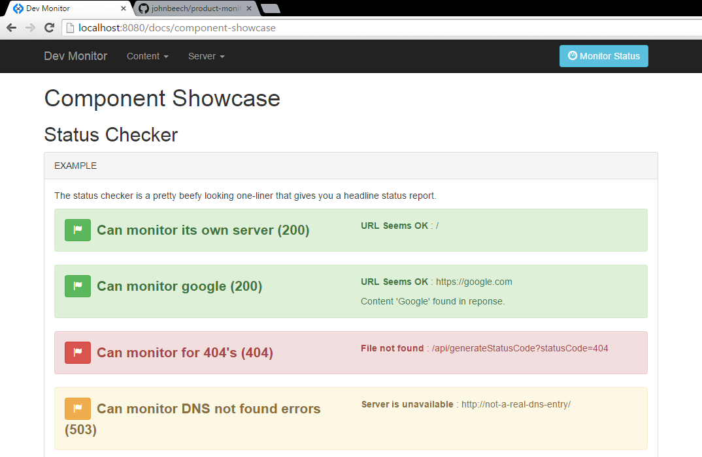

Product Monitor
===============

A HTML/JavaScript template for monitoring a product by encouraging product developers to gather all the information about the status of a product. The idea is to provide components to bring live monitoring, statistics, endpoints, and test results all into one place.

Uses a pattern of HTML/JavaScript components connected to custom JSON /api/ endpoints which can be created and customised in order to use your own declarative HTML templates to create a monitor customised to your project's needs.

[](http://badge.fury.io/js/product-monitor)

Key Features
------------
* Minimal setup
* Write simple HTML to configure your monitor
* Navigation generated dynamically by scanning `/content` folder
* API endpoints loaded dynamically by scanning `/api` folder
* Add a single javascript file to create custom JSON `/api/` endpoints
* Variable in-memory caching on all custom `/api/` endpoints
* Component Showcase and documentation served up through client
* Extremely simple wiring to load JSON data from custom templates, e.g. adding:
    ```html
    <template for="custom-web-component"><h2>{{name}}</h2><pre>{{dataSourceData}}</pre></template>
    ```
    Will enable data loading on:
    ```html
    <custom-web-component data-source-url="/api/packageInfo"></custom-web-component>
    ```
    *(No custom javascript required)*

* Bootstrap look and feel, using all their CSS advice and best practice
* Handlebar templates for rendering complex JSON data

What it looks like out of the box
---------------------------------



Which amounts to:
```html
<h3>Endpoints</h3>
<status-checker data-url="/">Can monitor its own server</status-checker>
<status-checker data-url="https://google.com" data-contains="Google">Can monitor google</status-checker>
<status-checker data-url="/api/generateStatusCode?statusCode=404">Can monitor for 404's</status-checker>
<status-checker data-url="http://not-a-real-dns-entry/">Can monitor DNS not found errors</status-checker>
```

### And with a bit of configuration:
```html
<octo-credits data-user="johnbeech" data-repo="product-monitor"></octo-credits>
```


How to get started
------------------

### Instructions to create your own product monitor via NPM

To use the latest release of `product-monitor` from NPM (https://www.npmjs.com/package/product-monitor) you can create your own NodeJS project as follows:

1\. Run `npm init` and enter in your project defaults

2\. Run `npm install product-monitor --save`  

3\. Create your own server.js file:  
```js
var monitor = require('product-monitor');
var server = monitor({
  "serverPort": 8080,
  "productInformation": {
    "title": "My Product Monitor",
  },
  "userContentPath": "user-content"
});
```
4\. Run your server using the command `node server.js`, you should see the following output:
```sh
[Startup Check] Created user content directory: monitoring

[Startup Step Finished] checkForUserDirectory

[Startup Info] Creating user content directory at user-content/content

Copying path /content

[Startup Info] Creating user API directory at: user-content/api

Copying path /api

Copied /content done!

[Startup Step Finished] checkForContentDirectory

Copied /api done!

[Startup Step Finished] checkForApiDirectory

[All Checks Complete]

My Product Monitor started on http://localhost:8080
```
5\.	Visit http://localhost:8080 to see the monitor in action

6\. Now that your server is running, read the supplied documentation, and try out the examples!


### Development Instructions using a checkout from github

1.	Check out (or fork) this project
2.	From the project root, run: `npm install`
3.  Run `npm test` to run a smoke test against the server
4.	Run `npm start` to start the monitor
5.	Visit http://localhost:8080

**Warning**: you might miss out on the latest updates to the server and its documentation if you check out this project directly from github. The recommended method for setting up a monitor is to use the NPM setup instructions.

Library Credits
---------------
Supplied via CDN:
- [Bootstrap](http://getbootstrap.com/) - basic styling and layout for client-side components
- [jQuery](https://jquery.com/) - for remote calls to server to drive components
- [Handlebars](http://handlebarsjs.com/) - for "minimal templating on steroids"
- [Node.js](https://nodejs.org/) - for package management and running the server instance
- [Strapdown.js](http://strapdownjs.com/) - for markdown rendering via `<markdown></markdown>` tags
- [Web Component JS](https://github.com/connected-web/web-component-js) - for enriching the client DOM with web component templates, providing the client-side data-loading and rendering logic for the product monitor.

Supplied via Node Package Manager:
- [Express](http://expressjs.com/) - for defining the server, the api endpoints, and serving up the client
- [md5-node](https://www.npmjs.com/package/md5-node) - for hashing keys in an in-memory cache
- [request](https://www.npmjs.com/package/request) - for making server side requests to remote domains
- [utils-merge](https://www.npmjs.com/package/utils-merge) - for merging configuration together with the default config
- [ncp](https://www.npmjs.com/package/npc) - for copying files used during setup of a new server instance
- And more... thanks to the community for such a diverse and useful set of libraries

Compatability
----------------
### Server

| NodeJS on | Support                       |
|-----------|-------------------------------|
| Windows 8 | Excellent                     |
| Mac OSX   | Excellent                     |
| Raspian   | Seems good                    |

### Client

| Browser  | Support                        |
|----------|--------------------------------|
| Chrome   | Excellent                      |
| Chromium | Seems good                     |
| Opera    | Works a treat                  |
| IE11     | Seems alright                  |
| Firefox  | Plays nice                     |

### Support and Feedback

Please get in touch for support and feedback by raising an issue here on this github project.
